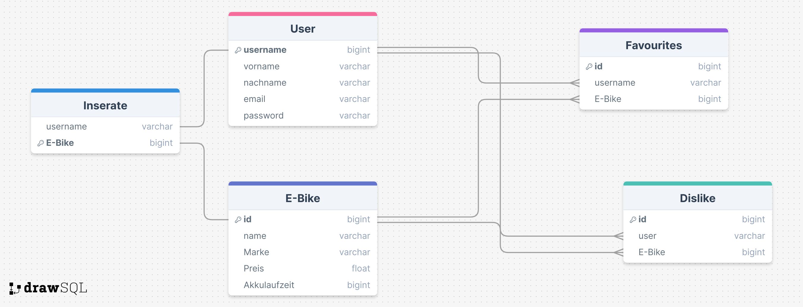

# Swapp-Datenbankplanung und -umsetzung

Christian Parushev 3CHIT; 28.05.2024

## Einführung:

Für unser ITP-Projekt, war ein Back-End mit zugehöriger Datenbank nötig. Die Planung, Umsetzung und Verbindung mit der Website wird hier dokumentiert.

## Projektbeschreibung:

Das Ziel des Projekts ist eine Website, auf der gebrauchet E-Bikes verkauft und gekauft werden können. E-Bikes können nicht durch eine Suchfunktion gefunden werden, sondern, ähnlich wie bei Tinder, werden die E-Bikes nacheinander angezeigt und man liked oder disliked.

## Theorie:

Wir haben uns für eine MariaDB-Datenbank entschieden, da wir damit am meisten Erfahrung haben und diese Datenbankart für dieses Projekt sehr Efiizient ist. Mittels PHP haben wir die Daten an die Datenbank geschickt (Front-End mit HTML, CSS, JS und Bootstrap).

## Umsetzung/Arbeitsschritte:

### 1. Planung:

Es wurde eine Tabelle für User und eine Für E-Bikes erstellt mit allen zugehörigen Daten. Außerdem eine Tabelle Favourites -> Diese speichert den User und das Bike, welches er geliked hat (Beide Foreign-Keys zu User und EBike). Genau dasselbe für Dislikes. Zuletzt noch eine Inserat Tabelle, bei der Auch der jeweilige User und sein inseriertes EBike als Foreign Keys gespeichert werden.



Für jeden Foreign Key wurde **Cascade** verwendet, da diese Option am sinnvollsten ist.

### 2. Umsetzung:

Zugehörig zur oberen Planung wurde eine passende Datenbank erstellt.

```sql
DROP DATABASE IF EXISTS Swapp;
CREATE DATABASE Swapp;
USE Swapp;


CREATE TABLE User (
    username VARCHAR(50) PRIMARY KEY,
    firstname VARCHAR(50),
    lastname VARCHAR(50),
    email VARCHAR(100),
    password VARCHAR(255)
);


CREATE TABLE EBike(
    id BIGINT PRIMARY KEY,
    name VARCHAR(255),
    marke VARCHAR(255),
    preis VARCHAR(255),
    akkulaufzeit VARCHAR(255),
    gebrauchszustand VARCHAR(255),
    image VARCHAR(255)
);


CREATE TABLE Inserat (
    username VARCHAR(50),
    ebike BIGINT PRIMARY KEY,
    FOREIGN KEY (username) REFERENCES User(username) ON DELETE CASCADE ON UPDATE CASCADE,
    FOREIGN KEY (ebike) REFERENCES Ebike(id) ON DELETE CASCADE ON UPDATE CASCADE
);


CREATE USER 'test'@'%' IDENTIFIED BY 'test';
GRANT ALL PRIVILEGES ON *.* TO 'test'@'%' WITH GRANT OPTION;
FLUSH PRIVILEGES;


CREATE TABLE Favourites (
    id BIGINT PRIMARY KEY,
    username VARCHAR(50),
    ebike BIGINT,
    FOREIGN KEY (username) REFERENCES User(username) ON DELETE CASCADE ON UPDATE CASCADE,
    FOREIGN KEY (ebike) REFERENCES Ebike(id) ON DELETE CASCADE ON UPDATE CASCADE
);


CREATE TABLE Dislikes (
    id BIGINT PRIMARY KEY,
    username VARCHAR(50),
    ebike BIGINT,
    FOREIGN KEY (username) REFERENCES User(username) ON DELETE CASCADE ON UPDATE CASCADE,
    FOREIGN KEY (ebike) REFERENCES Ebike(id) ON DELETE CASCADE ON UPDATE CASCADE
);
```

## 3. Verbindung mit Website

Für alle Datenbankverbindungen sowohl zum Schreiben als auch zum Lesen, habe ich PDO's verwendet. Bei den vorgeschlagenen E-Bikes habe ich mit LEFT JOINS gearbeitet, damit nur die E-Bikes angezeigt werden, die auch noch nicht vom Benutzer bewertet wurden (Like/Dislike).

**Beispiele:**

```sql
SELECT * FROM Inserat i
INNER JOIN EBike e
ON i.ebike = e.id
WHERE i.username = ?;        
```

Dieses Query gibt mittels INNER JOIN alle Daten von allen inserierten E-Bikes mit zugehörigem Username aus.

```sql
SELECT EBike.id, EBike.name, EBike.marke, EBike.preis, EBike.akkulaufzeit, EBike.gebrauchszustand, EBike.image
FROM EBike
LEFT JOIN Favourites ON EBike.id = Favourites.ebike AND Favourites.username = ?
LEFT JOIN Dislikes ON EBike.id = Dislikes.ebike AND Dislikes.username = ?
WHERE Favourites.ebike IS NULL AND Dislikes.ebike IS NULL;
```

Dadurch, dass man nicht will, dass einem User ein E-Bike nochmal vorgeschlagen wird, obwohl er es schon bewertet hat, gibt es die Tabellen Favourites und Dislikes, worin gespeichert wird, welches E-Bike von welchem User geliked wurde. Somit muss man mit einem OUTER JOIN alle E-Bikes ausgeben, die gleichzeitig nicht in Favourites und Dislikes gespeichert wurden.

```sql
INSERT INTO EBike(id, name, marke, preis, akkulaufzeit, gebrauchszustand, image)
VALUES(?, ?, ?, ?, ?, ?, ?);
```

Dieses Query wird ausgeführt, wenn ein E-Bike hochgeladen wird. In Image wird der Pfad zum Bild gespeichert. Die Fragezeichen sind Platzhalte für ein Prepared Statement.

## Zusammenfassung:

Der Teil des Projekts wurde aus dem Wissen aus dem Unterricht ermöglicht. Durch die gute Planung der Datenbank, gab es bei der Umsetzung keine Probleme.
